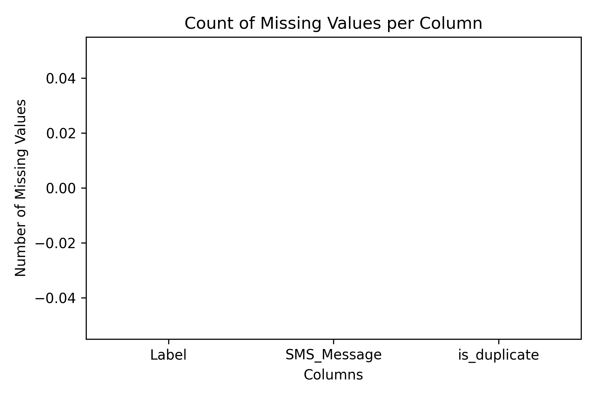

# Metadata

## Data Summary
- 5,574 SMS messages total
- 747 spam, 4,827 ham (legitimate)
- Text messages collected between 2004–2005

## Provenance
- Source: UCI Machine Learning Repository  
- Contributions from Grumbletext forum (UK), NUS SMS Corpus, Caroline Tag PhD thesis, SMS Spam Corpus v.0.1  
- Compiled by Almeida et al. (2005)

## License
- Creative Commons Attribution 4.0 (CC BY 4.0)  
- Free to use, share, and adapt with attribution

## Ethical Statements
- Messages are anonymized, no personal identifiers included  
- Data is provided for educational/research use only  
- Use must respect privacy and avoid attempts at re-identification  

## Data Dictionary
- **Label**: `spam` or `ham` (categorical variable)  
- **Message**: Full text of the SMS message (string)  

# Exploratory Plots

We generated four exploratory plots to better understand the SMS Spam Collection dataset. These plots highlight class imbalance, data quality, and message characteristics.

### 1. Class Distribution (Ham vs Spam)
Shows the frequency of ham vs spam messages. The imbalance emphasizes the need for oversampling.

---

### 2. Duplicates by Category
Displays how many duplicate messages exist within each class, confirming whether repeated messages could bias the model.

---

### 3. Message Length Distribution
Compares message length between ham and spam. Spam messages are typically longer, suggesting length could be a useful feature.

---

### 4. Missing Values
Checks for null or missing entries in both `Label` and `Message`. The dataset is clean with no missing values.

